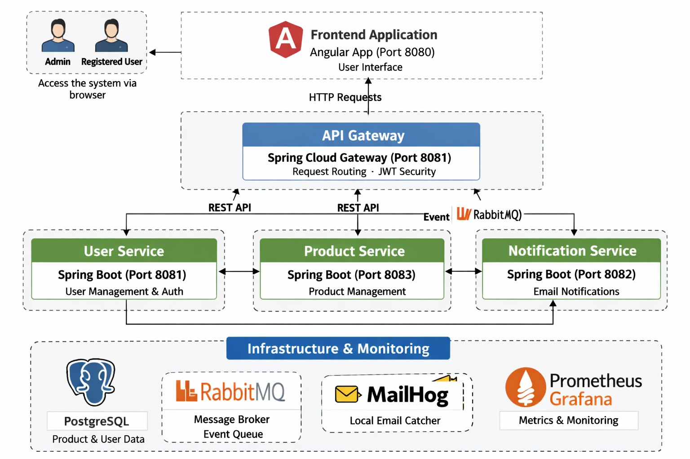

# projeto-aios-squad-full-stack

Projeto full stack enterprise-grade para cadastro e gestao de produtos com autenticacao JWT, microsservicos, arquitetura hexagonal e comunicacao assincrona via RabbitMQ.

## Arquitetura C4



## Execucao (planejado)

Backend:

```bash
docker compose -f backend-compose.yml up -d
```

Frontend:

```bash
docker compose -f frontend-compose.yml up -d
```
